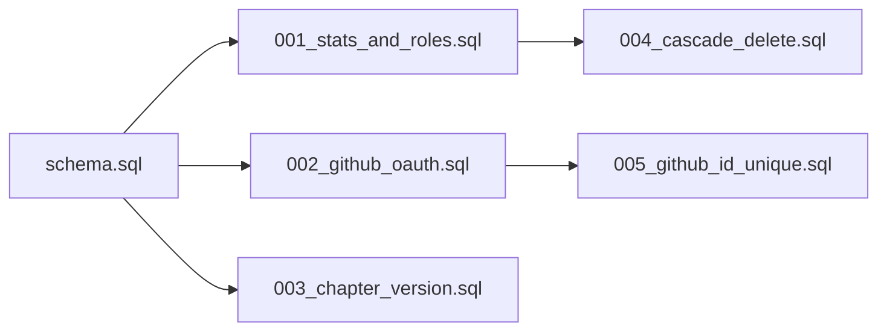

# 项目修复方案

**创建日期**: 2026-03-22  
**基于审查报告**: frontend-review.md, backend-review.md, database-review.md, style-review.md, SUMMARY.md

---

## 1. 修复优先级总览

### 问题统计

| 优先级 | 描述 | 数量 | 修复时间建议 |
|-------|------|------|-------------|
| P0 | 立即修复 - 安全漏洞、数据丢失风险 | 14 | 立即 |
| P1 | 本周修复 - 功能Bug、严重用户体验问题 | 26 | 1周内 |
| P2 | 两周内修复 - 中等优先级问题 | 28 | 2周内 |
| P3 | 迭代优化 - 轻微问题、代码质量改进 | 22 | 迭代中 |

### P0 问题清单（立即修复）

| # | 模块 | 问题 | 风险等级 |
|---|------|------|---------|
| 1 | 后端 | SQL注入风险 - 动态ORDER BY | 🔴 严重 |
| 2 | 后端 | SQL注入风险 - 动态SET子句 | 🔴 严重 |
| 3 | 后端 | SQL注入风险 - 动态WHERE子句 | 🔴 严重 |
| 4 | 数据库 | 外键缺少级联删除 | 🔴 严重 |
| 5 | 数据库 | GitHub ID缺少唯一约束 | 🔴 严重 |
| 6 | 数据库 | 迁移脚本不可逆 | 🔴 严重 |
| 7 | 数据库 | 迁移与Schema重复定义 | 🔴 严重 |
| 8 | 前端 | 密码修改后未清除认证状态 | 🔴 严重 |
| 9 | 前端 | 批注系统选区状态丢失 | 🔴 严重 |
| 10 | 前端 | EPUB导入DRM检测不完整 | 🔴 严重 |
| 11 | 样式 | 移动端断点单一 | 🔴 严重 |
| 12 | 样式 | 触摸设备优化不足 | 🔴 严重 |
| 13 | 样式 | 翻页模式布局计算问题 | 🔴 严重 |
| 14 | 样式 | z-index层级混乱 | 🔴 严重 |

---

## 2. 详细修复方案

### 2.1 后端安全修复（P0）

#### 问题 #1: SQL注入风险 - 动态ORDER BY

**文件位置**: [`functions/api/annotations.js:129`](../functions/api/annotations.js:129)

**当前代码**:
```javascript
const orderBy = sort === 'hot' ? 'like_count DESC, a.created_at DESC' : 'a.created_at DESC';
// ...
ORDER BY ${orderBy}
```

**修复后代码**:
```javascript
// 定义允许的排序方式白名单
const VALID_SORT_OPTIONS = {
  'hot': 'like_count DESC, a.created_at DESC',
  'latest': 'a.created_at DESC',
  'oldest': 'a.created_at ASC'
};

// 使用白名单验证，默认按时间倒序
const orderBy = VALID_SORT_OPTIONS[sort] || VALID_SORT_OPTIONS['latest'];

// SQL中使用参数化（此处orderBy已通过白名单验证，安全）
const rows = await env.DB.prepare(`
  SELECT a.id, a.content, a.visibility, a.created_at, a.user_id,
         u.username, u.avatar_url,
         CASE WHEN a.user_id = ? THEN 1 ELSE 0 END as is_mine,
         (SELECT COUNT(*) FROM annotation_likes WHERE annotation_id = a.id) as like_count,
         (SELECT 1 FROM annotation_likes WHERE annotation_id = a.id AND user_id = ?) as liked
  FROM annotations a
  LEFT JOIN admin_users u ON a.user_id = u.id
  WHERE a.chapter_id = ? AND a.para_idx = ? AND a.sent_idx = ? AND a.status = 'normal'
    AND (a.visibility = 'public' OR a.user_id = ?)
  ORDER BY ${orderBy}
  LIMIT 50
`).bind(userId, userId, chapterId, paraIdx, sentIdx, userId).all();
```

**测试验证方法**:
1. 单元测试：验证非法sort参数被正确处理
2. 集成测试：发送 `?sort=hot; DROP TABLE annotations--` 等恶意参数，确认被安全处理
3. 代码审查：确认所有动态SQL字段都使用白名单

---

#### 问题 #2: SQL注入风险 - 动态SET子句

**文件位置**: [`functions/api/admin/users.js:126-134`](../functions/api/admin/users.js:126)

**当前代码**:
```javascript
const sets = [];
if (hasRole) { sets.push('role = ?'); binds.push(body.role); }
if (hasPwdLock) { sets.push('password_locked = ?'); binds.push(body.password_locked === 1 ? 1 : 0); }
sets.push("updated_at = datetime('now')");
binds.push(body.id);

await env.DB.prepare(`UPDATE admin_users SET ${sets.join(', ')} WHERE id = ?`)
  .bind(...binds).run();
```

**修复后代码**:
```javascript
// 定义允许更新的字段白名单
const ALLOWED_UPDATE_FIELDS = {
  'role': { type: 'string', validate: (v) => ['super_admin', 'admin', 'editor'].includes(v) },
  'password_locked': { type: 'number', validate: (v) => v === 0 || v === 1 }
};

// 构建安全的更新语句
const sets = [];
const binds = [];

if (hasRole) {
  // 验证角色值
  if (!ALLOWED_UPDATE_FIELDS.role.validate(body.role)) {
    return Response.json({ error: '无效的角色值' }, { status: 400 });
  }
  sets.push('role = ?');
  binds.push(body.role);
}

if (hasPwdLock) {
  const lockValue = body.password_locked === 1 ? 1 : 0;
  sets.push('password_locked = ?');
  binds.push(lockValue);
}

sets.push("updated_at = datetime('now')");
binds.push(body.id);

// 使用静态SQL模板，字段名来自代码硬编码
await env.DB.prepare(`UPDATE admin_users SET ${sets.join(', ')} WHERE id = ?`)
  .bind(...binds).run();
```

**测试验证方法**:
1. 单元测试：验证非法角色值被拒绝
2. 集成测试：尝试注入恶意字段名，确认请求被拒绝
3. 边界测试：测试空值、超长值、特殊字符

---

#### 问题 #3: SQL注入风险 - 动态WHERE子句

**文件位置**: [`functions/api/admin/annotations.js:42-101`](../functions/api/admin/annotations.js:42)

**当前代码**:
```javascript
const whereClause = where.length > 0 ? 'WHERE ' + where.join(' AND ') : '';
// ...
const listSql = `... ${whereClause} ORDER BY ${orderBy} ...`;
```

**修复后代码**:
```javascript
// 构建查询条件 - 所有条件都使用参数化
const { where, binds } = buildPermissionFilter(auth);

// 定义允许的状态和可见性值
const VALID_STATUSES = ['normal', 'reported', 'removed'];
const VALID_VISIBILITIES = ['public', 'private'];
const VALID_SORT_OPTIONS = {
  'latest': 'a.created_at DESC',
  'oldest': 'a.created_at ASC'
};

// 安全地添加查询条件
if (bookId) {
  where.push('a.book_id = ?');
  binds.push(parseInt(bookId, 10) || 0);
}

if (status && status !== 'all') {
  if (!VALID_STATUSES.includes(status)) {
    return Response.json({ error: '无效的状态' }, { status: 400 });
  }
  where.push('a.status = ?');
  binds.push(status);
}

if (visibility && visibility !== 'all') {
  if (!VALID_VISIBILITIES.includes(visibility)) {
    return Response.json({ error: '无效的类型' }, { status: 400 });
  }
  where.push('a.visibility = ?');
  binds.push(visibility);
}

if (search) {
  // 转义LIKE通配符
  const escapedSearch = search.replace(/[%_]/g, '\\$&');
  where.push('(a.content LIKE ? ESCAPE "\\\\" OR a.sent_text LIKE ? ESCAPE "\\\\")');
  binds.push(`%${escapedSearch}%`, `%${escapedSearch}%`);
}

const whereClause = where.length > 0 ? 'WHERE ' + where.join(' AND ') : '';

// 使用白名单验证排序
const orderBy = VALID_SORT_OPTIONS[sort] || VALID_SORT_OPTIONS['latest'];

// 执行查询
const listSql = `
  SELECT a.id, a.chapter_id, a.book_id, a.user_id, a.para_idx, a.sent_idx,
         a.sent_text, a.content, a.visibility, a.status, a.created_at,
         u.username, u.role as user_role,
         b.title as book_title,
         c.title as chapter_title,
         (SELECT COUNT(*) FROM annotation_likes WHERE annotation_id = a.id) as like_count
  FROM annotations a
  LEFT JOIN admin_users u ON a.user_id = u.id
  LEFT JOIN books b ON a.book_id = b.id
  LEFT JOIN chapters c ON a.chapter_id = c.id
  ${whereClause}
  ORDER BY ${orderBy}
  LIMIT ? OFFSET ?
`;
const listResult = await env.DB.prepare(listSql).bind(...binds, limit, offset).all();
```

**测试验证方法**:
1. 单元测试：验证所有输入参数的白名单校验
2. 安全测试：使用SQLMap等工具进行自动化注入测试
3. 集成测试：验证各种查询组合的正确性

---

### 2.2 数据库修复（P0/P1）

#### 问题 #4: 外键缺少级联删除

**文件位置**: [`schema.sql:22`](../schema.sql:22)

**当前代码**:
```sql
FOREIGN KEY (book_id) REFERENCES books(id)
```

**修复SQL语句**:
```sql
-- 注意：SQLite不支持直接修改外键约束
-- 需要重建表

-- 步骤1：创建新表（带级联删除）
CREATE TABLE chapters_new (
  id INTEGER PRIMARY KEY AUTOINCREMENT,
  book_id INTEGER NOT NULL,
  title TEXT NOT NULL,
  sort_order INTEGER NOT NULL,
  word_count INTEGER DEFAULT 0,
  content_key TEXT NOT NULL,
  created_at TEXT DEFAULT (datetime('now')),
  updated_at TEXT DEFAULT (datetime('now')),
  FOREIGN KEY (book_id) REFERENCES books(id) ON DELETE CASCADE
);

-- 步骤2：复制数据
INSERT INTO chapters_new SELECT * FROM chapters;

-- 步骤3：删除旧表
DROP TABLE chapters;

-- 步骤4：重命名新表
ALTER TABLE chapters_new RENAME TO chapters;

-- 步骤5：重建索引
CREATE INDEX IF NOT EXISTS idx_chapters_book_id ON chapters(book_id);
CREATE INDEX IF NOT EXISTS idx_chapters_sort_order ON chapters(book_id, sort_order);
```

**迁移脚本示例** (`migrations/004_cascade_delete.sql`):
```sql
-- Migration 004: 添加外键级联删除
-- 执行: wrangler d1 execute novel-db --file migrations/004_cascade_delete.sql --remote

-- 备份说明：执行前请确保有数据备份

BEGIN TRANSACTION;

-- 重建 chapters 表
CREATE TABLE chapters_new (
  id INTEGER PRIMARY KEY AUTOINCREMENT,
  book_id INTEGER NOT NULL,
  title TEXT NOT NULL,
  sort_order INTEGER NOT NULL,
  word_count INTEGER DEFAULT 0,
  content_key TEXT NOT NULL,
  created_at TEXT DEFAULT (datetime('now')),
  updated_at TEXT DEFAULT (datetime('now')),
  FOREIGN KEY (book_id) REFERENCES books(id) ON DELETE CASCADE
);

INSERT INTO chapters_new SELECT * FROM chapters;
DROP TABLE chapters;
ALTER TABLE chapters_new RENAME TO chapters;

CREATE INDEX IF NOT EXISTS idx_chapters_book_id ON chapters(book_id);
CREATE INDEX IF NOT EXISTS idx_chapters_sort_order ON chapters(book_id, sort_order);

COMMIT;
```

**数据迁移注意事项**:
1. 执行前必须完整备份数据库
2. 在低峰期执行，避免影响服务
3. 执行后验证数据完整性：`SELECT COUNT(*) FROM chapters;`
4. 测试删除书籍时章节是否正确级联删除

---

#### 问题 #5: GitHub ID缺少唯一约束

**文件位置**: [`migrations/002_github_oauth.sql:5`](../migrations/002_github_oauth.sql:5)

**当前代码**:
```sql
ALTER TABLE admin_users ADD COLUMN github_id INTEGER DEFAULT NULL;
```

**修复SQL语句**:
```sql
-- 添加唯一索引（部分索引，只对非NULL值生效）
CREATE UNIQUE INDEX IF NOT EXISTS idx_admin_users_github_id_unique 
ON admin_users(github_id) 
WHERE github_id IS NOT NULL;
```

**迁移脚本示例** (`migrations/005_github_id_unique.sql`):
```sql
-- Migration 005: GitHub ID 唯一约束
-- 执行: wrangler d1 execute novel-db --file migrations/005_github_id_unique.sql --remote

-- 检查是否存在重复的 github_id
-- 如果有重复，需要先手动处理

-- 创建唯一索引（部分索引）
CREATE UNIQUE INDEX IF NOT EXISTS idx_admin_users_github_id_unique 
ON admin_users(github_id) 
WHERE github_id IS NOT NULL;
```

**数据迁移注意事项**:
1. 执行前检查是否有重复的 github_id：
   ```sql
   SELECT github_id, COUNT(*) as cnt 
   FROM admin_users 
   WHERE github_id IS NOT NULL 
   GROUP BY github_id 
   HAVING cnt > 1;
   ```
2. 如有重复，需要先合并或删除重复账号
3. 索引创建后，重复绑定将被数据库拒绝

---

#### 问题 #6 & #7: 迁移脚本问题

**问题描述**: 
1. 迁移脚本不可逆，无法回滚
2. 迁移与Schema重复定义

**修复方案**:

**方案一：创建回滚脚本**

创建 `migrations/down/` 目录，存放回滚脚本：

`migrations/down/001_stats_and_roles_rollback.sql`:
```sql
-- Rollback for Migration 001
-- 警告：这将删除所有统计数据

-- 删除统计相关表
DROP TABLE IF EXISTS site_visits;
DROP TABLE IF EXISTS daily_visitors;
DROP TABLE IF EXISTS book_stats;
DROP TABLE IF EXISTS chapter_stats;

-- 移除role字段（SQLite不支持DROP COLUMN，需要重建表）
CREATE TABLE admin_users_backup AS 
SELECT id, username, password_hash, created_at, updated_at 
FROM admin_users;

DROP TABLE admin_users;
ALTER TABLE admin_users_backup RENAME TO admin_users;
```

`migrations/down/002_github_oauth_rollback.sql`:
```sql
-- Rollback for Migration 002
-- 警告：这将删除所有GitHub OAuth关联

-- 重建表以移除字段
CREATE TABLE admin_users_backup AS 
SELECT id, username, password_hash, role, created_at, updated_at 
FROM admin_users;

DROP TABLE admin_users;
ALTER TABLE admin_users_backup RENAME TO admin_users;

-- 重建相关索引
CREATE UNIQUE INDEX IF NOT EXISTS idx_admin_users_username ON admin_users(username);
```

**方案二：解决Schema与迁移重复**

修改 `schema.sql`，只包含基础表定义：

```sql
-- schema.sql - 基础表结构（仅包含核心表）
-- 统计表由迁移 001 创建

-- 作品表
CREATE TABLE IF NOT EXISTS books (
  id INTEGER PRIMARY KEY AUTOINCREMENT,
  title TEXT NOT NULL,
  description TEXT DEFAULT '',
  author TEXT DEFAULT '',
  cover_key TEXT DEFAULT '',
  created_at TEXT DEFAULT (datetime('now')),
  updated_at TEXT DEFAULT (datetime('now'))
);

-- 章节表
CREATE TABLE IF NOT EXISTS chapters (
  id INTEGER PRIMARY KEY AUTOINCREMENT,
  book_id INTEGER NOT NULL,
  title TEXT NOT NULL,
  sort_order INTEGER NOT NULL,
  word_count INTEGER DEFAULT 0,
  content_key TEXT NOT NULL,
  created_at TEXT DEFAULT (datetime('now')),
  updated_at TEXT DEFAULT (datetime('now')),
  FOREIGN KEY (book_id) REFERENCES books(id) ON DELETE CASCADE
);

CREATE INDEX IF NOT EXISTS idx_chapters_book_id ON chapters(book_id);
CREATE INDEX IF NOT EXISTS idx_chapters_sort_order ON chapters(book_id, sort_order);

-- 管理员账号表（基础字段）
CREATE TABLE IF NOT EXISTS admin_users (
  id INTEGER PRIMARY KEY AUTOINCREMENT,
  username TEXT UNIQUE NOT NULL,
  password_hash TEXT,
  created_at TEXT DEFAULT (datetime('now')),
  updated_at TEXT DEFAULT (datetime('now'))
);

-- 会话表
CREATE TABLE IF NOT EXISTS admin_sessions (
  token TEXT PRIMARY KEY,
  user_id INTEGER NOT NULL,
  expires_at TEXT NOT NULL,
  created_at TEXT DEFAULT (datetime('now')),
  FOREIGN KEY (user_id) REFERENCES admin_users(id) ON DELETE CASCADE
);

-- 站点设置表
CREATE TABLE IF NOT EXISTS site_settings (
  key TEXT PRIMARY KEY,
  value TEXT NOT NULL
);

-- 认证限流表
CREATE TABLE IF NOT EXISTS auth_attempts (
  ip_hash TEXT PRIMARY KEY,
  fail_count INTEGER DEFAULT 0,
  locked_until TEXT,
  last_attempt TEXT DEFAULT (datetime('now'))
);

-- 默认设置
INSERT OR IGNORE INTO site_settings (key, value) VALUES ('site_name', '我的书架');
INSERT OR IGNORE INTO site_settings (key, value) VALUES ('site_desc', '私人小说站');
INSERT OR IGNORE INTO site_settings (key, value) VALUES ('footer_text', '');
```

修改 `migrations/001_stats_and_roles.sql`，使用幂等方式：

```sql
-- Migration 001: 访问统计 + 多管理员角色
-- 使用 IF NOT EXISTS 确保幂等性

-- ========== 访问统计 ==========
CREATE TABLE IF NOT EXISTS site_visits (
  date TEXT PRIMARY KEY,
  pv INTEGER DEFAULT 0,
  uv INTEGER DEFAULT 0
);

CREATE TABLE IF NOT EXISTS daily_visitors (
  date TEXT NOT NULL,
  ip_hash TEXT NOT NULL,
  PRIMARY KEY (date, ip_hash)
);

CREATE TABLE IF NOT EXISTS book_stats (
  book_id INTEGER NOT NULL,
  date TEXT NOT NULL,
  views INTEGER DEFAULT 0,
  PRIMARY KEY (book_id, date),
  FOREIGN KEY (book_id) REFERENCES books(id) ON DELETE CASCADE
);

CREATE TABLE IF NOT EXISTS chapter_stats (
  chapter_id INTEGER PRIMARY KEY,
  views INTEGER DEFAULT 0,
  FOREIGN KEY (chapter_id) REFERENCES chapters(id) ON DELETE CASCADE
);

-- 索引
CREATE INDEX IF NOT EXISTS idx_site_visits_date ON site_visits(date);
CREATE INDEX IF NOT EXISTS idx_book_stats_book_date ON book_stats(book_id, date);
CREATE INDEX IF NOT EXISTS idx_daily_visitors_date ON daily_visitors(date);

-- ========== 多管理员角色 ==========
-- 安全添加字段（忽略已存在错误）
ALTER TABLE admin_users ADD COLUMN role TEXT DEFAULT 'editor';

-- 升级第一个管理员
UPDATE admin_users SET role = 'super_admin' WHERE id = (SELECT MIN(id) FROM admin_users);
```

---

### 2.3 前端Bug修复（P1）

#### 问题 #8: 密码修改后未清除认证状态

**文件位置**: [`admin.html:630-631`](../admin.html:630)

**当前代码**:
```javascript
showMsg('pwd-msg','密码已修改，请重新登录','success');
setTimeout(()=>doLogout(), 2000);
```

**问题描述**: `doLogout()` 函数只显示登录面板，没有清除 sessionStorage/localStorage 中的认证状态。

**修复代码**:
```javascript
// 修改密码修改成功后的处理
showMsg('pwd-msg','密码已修改，请重新登录','success');
setTimeout(() => {
  // 清除所有认证相关状态
  sessionStorage.removeItem('auth_role');
  sessionStorage.removeItem('auth_uid');
  localStorage.removeItem('auth_token');
  // 调用登出函数
  doLogout();
}, 2000);
```

**同时需要检查 doLogout 函数**:
```javascript
function doLogout() {
  // 确保清除所有认证状态
  sessionStorage.removeItem('auth_role');
  sessionStorage.removeItem('auth_uid');
  localStorage.removeItem('auth_token');
  
  // 清除UI状态
  document.getElementById('login-panel').classList.add('active');
  document.getElementById('admin-panel').classList.remove('active');
  
  // 重置表单
  document.getElementById('login-user').value = '';
  document.getElementById('login-pass').value = '';
}
```

**测试场景**:
1. 修改密码后检查 sessionStorage/localStorage 是否清空
2. 修改密码后刷新页面，确认需要重新登录
3. 验证旧Token是否失效

---

#### 问题 #9: 批注系统选区状态丢失

**文件位置**: [`read.html:1490-1507`](../read.html:1490)

**当前代码**:
```javascript
async function openAnnotationEditor() {
  document.getElementById('anno-float-btn').classList.remove('visible');

  if (!annoState.sentText) {
    console.warn('[anno] sentText empty, trying to recover from selection');
    const sel = window.getSelection();
    if (sel && !sel.isCollapsed) {
      showFloatBtnForSelection(sel);
      // 恢复逻辑可能失败
    }
  }
}
```

**问题描述**: 点击浮动按钮时，选区已被清除，无法恢复。

**修复代码**:
```javascript
// 在文件顶部添加保存选区的变量
let savedRange = null;

// 修改 showFloatBtnForSelection 函数，保存选区
function showFloatBtnForSelection(selection) {
  const range = selection.getRangeAt(0);
  const rect = range.getBoundingClientRect();
  
  // 保存选区的Range对象
  savedRange = range.cloneRange();
  
  // ... 其余代码不变
}

// 修改 openAnnotationEditor 函数
async function openAnnotationEditor() {
  document.getElementById('anno-float-btn').classList.remove('visible');

  // 优先使用保存的选区
  if (!annoState.sentText && savedRange) {
    console.log('[anno] Using saved range');
    // 恢复选区
    const selection = window.getSelection();
    selection.removeAllRanges();
    selection.addRange(savedRange);
    
    // 重新提取文本
    const text = selection.toString().trim();
    if (text) {
      annoState.sentText = text;
    }
  }

  if (!annoState.sentText) {
    alert('请先选中一段文字');
    savedRange = null;
    return;
  }

  try {
    annoState.editing = true;
    annoState.sentHash = await sentenceHash(annoState.sentText);
    
    // ... 其余代码不变
  } catch (e) {
    console.error('[anno] Error:', e);
    alert('批注创建失败，请重试');
  } finally {
    // 清除保存的选区
    savedRange = null;
  }
}

// 在批注提交成功或取消后清除保存的选区
function closeAnnotationEditor() {
  savedRange = null;
  annoState.editing = false;
  // ... 其余代码
}
```

**测试场景**:
1. 选中文字后点击浮动按钮，验证批注编辑器正常打开
2. 选中文字后点击其他地方，再点击浮动按钮，验证行为
3. 快速连续创建多个批注，验证状态正确

---

#### 问题 #10: EPUB导入DRM检测不完整

**文件位置**: [`admin.html:1603-1610`](../admin.html:1603)

**当前代码**:
```javascript
const encryptionXml = await zip.file('META-INF/encryption.xml')?.async('text');
if (encryptionXml) {
  const encDoc = new DOMParser().parseFromString(encryptionXml, 'application/xml');
  if (encDoc.querySelectorAll('EncryptedData').length > 0) {
    throw new Error('此 EPUB 文件包含 DRM 加密，无法导入。请使用未加密的 EPUB 文件。');
  }
}
```

**修复代码**:
```javascript
async function checkDRM(zip) {
  const encryptionXml = await zip.file('META-INF/encryption.xml')?.async('text').catch(() => null);
  
  if (!encryptionXml) {
    return { hasDRM: false };
  }

  const encDoc = new DOMParser().parseFromString(encryptionXml, 'application/xml');
  
  // 检查多种DRM标识
  const drmIndicators = [
    'EncryptedData',
    'EncryptedKey', 
    'CipherReference',
    'CipherValue',
    'enc:EncryptedData',
    'adept:encrypted'
  ];
  
  for (const indicator of drmIndicators) {
    if (encDoc.querySelectorAll(indicator).length > 0) {
      return { 
        hasDRM: true, 
        reason: `检测到加密元素: ${indicator}` 
      };
    }
  }
  
  // 检查特定的DRM命名空间
  const drmNamespaces = [
    'urn:uuid:6b3d3c40-ebc3-11d9-8e3a-0002b3ae9c49', // Adobe Adept
    'http://www.w3.org/2001/04/xmlenc#', // XML Encryption
    'http://ns.adobe.com/adept' // Adobe Adept
  ];
  
  const rootElement = encDoc.documentElement;
  const xmlns = rootElement.getAttribute('xmlns') || '';
  
  for (const ns of drmNamespaces) {
    if (xmlns.includes(ns)) {
      return { 
        hasDRM: true, 
        reason: '检测到DRM命名空间' 
      };
    }
  }
  
  return { hasDRM: false };
}

// 使用示例
const drmCheck = await checkDRM(zip);
if (drmCheck.hasDRM) {
  throw new Error(`此 EPUB 文件包含 DRM 加密（${drmCheck.reason}），无法导入。请使用未加密的 EPUB 文件。`);
}
```

**测试场景**:
1. 导入正常EPUB文件，验证成功
2. 导入Adobe DRM加密的EPUB，验证被正确检测
3. 导入其他类型加密的EPUB，验证检测逻辑

---

### 2.4 样式修复（P1/P2）

#### 问题 #11: 移动端断点单一

**文件位置**: [`style.css:576-598`](../style.css:576)

**当前代码**:
```css
@media (max-width: 640px) {
  .book-grid { grid-template-columns: 1fr; }
  /* ... */
}
```

**修复代码**:
```css
/* ===== 响应式断点系统 ===== */

/* 大屏桌面 (默认) */
/* 无需媒体查询 */

/* 平板设备 (768px - 1024px) */
@media (max-width: 1024px) {
  .book-grid-cover { 
    grid-template-columns: repeat(auto-fill, minmax(160px, 1fr)); 
  }
  
  .book-grid-list {
    grid-template-columns: repeat(auto-fill, minmax(280px, 1fr));
  }
}

/* 小屏平板 / 大屏手机 (640px - 768px) */
@media (max-width: 768px) {
  .book-grid-cover { 
    grid-template-columns: repeat(auto-fill, minmax(140px, 1fr)); 
  }
  
  .book-grid-list {
    grid-template-columns: 1fr;
  }
  
  .navbar nav {
    gap: 12px;
  }
  
  .reader-content {
    padding: 16px;
  }
}

/* 手机设备 (< 640px) */
@media (max-width: 640px) {
  .book-grid { 
    grid-template-columns: 1fr; 
  }
  
  .book-grid-cover { 
    grid-template-columns: repeat(2, 1fr); 
  }
  
  .navbar nav {
    gap: 8px;
    font-size: 14px;
  }
  
  .theme-toggle, .font-btn {
    min-width: 44px;
    min-height: 44px;
  }
}
```

---

#### 问题 #12: 触摸设备优化不足

**文件位置**: [`style.css`](../style.css) 全局

**修复代码**:
```css
/* ===== 触摸设备优化 ===== */

/* 确保触摸目标足够大 (iOS HIG 推荐 44x44px) */
button,
.btn,
.theme-toggle,
.font-btn,
.tag-pill,
.book-card,
.chapter-list a {
  min-height: 44px;
  min-width: 44px;
}

/* 对于内联元素，使用伪元素扩大点击区域 */
.tag-pill {
  position: relative;
}

.tag-pill::before {
  content: '';
  position: absolute;
  top: -8px;
  left: -8px;
  right: -8px;
  bottom: -8px;
}

/* 统一禁用 tap highlight */
button,
a,
.btn,
.tag-pill,
.book-card,
.chapter-list a {
  -webkit-tap-highlight-color: transparent;
}

/* 触摸设备优化 */
@media (hover: none) and (pointer: coarse) {
  /* 增加按钮间距 */
  .btn-group {
    gap: 12px;
  }
  
  /* 增大表单元素 */
  input, select, textarea {
    font-size: 16px; /* 防止iOS缩放 */
    min-height: 44px;
  }
  
  /* 增大复选框和单选框 */
  input[type="checkbox"],
  input[type="radio"] {
    width: 24px;
    height: 24px;
  }
}

/* 触摸滚动优化 */
.tag-filter-bar,
.chapter-list,
.annotation-list {
  -webkit-overflow-scrolling: touch;
  overscroll-behavior: contain;
}
```

---

#### 问题 #14: z-index层级混乱

**文件位置**: [`style.css:887-1126`](../style.css:887)

**修复代码**:
```css
/* ===== z-index 层级系统 ===== */

:root {
  /* 基础层级 */
  --z-base: 1;
  
  /* 下拉菜单 */
  --z-dropdown: 100;
  
  /* 粘性元素 */
  --z-sticky: 200;
  
  /* 遮罩层 */
  --z-overlay: 300;
  
  /* 模态框 */
  --z-modal: 400;
  
  /* 批注相关 */
  --z-annotation: 500;
  
  /* Toast/通知 */
  --z-toast: 600;
  
  /* 最高层级 */
  --z-top: 9999;
}

/* 应用层级变量 */
.navbar {
  z-index: var(--z-sticky);
}

.reader-bottom-bar {
  z-index: var(--z-sticky);
}

.progress-bar {
  z-index: var(--z-base);
}

.settings-overlay {
  z-index: var(--z-overlay);
}

.anno-float-btn {
  z-index: var(--z-annotation);
}

.anno-editor {
  z-index: var(--z-modal);
}

.anno-popover {
  z-index: var(--z-annotation);
}

/* Toast 通知 */
.toast {
  z-index: var(--z-toast);
}
```

---

#### 问题 #5: 颜色对比度不足

**文件位置**: [`style.css:4-68`](../style.css:4)

**修复代码**:
```css
/* ===== 主题颜色（符合 WCAG AA 标准） ===== */

:root {
  /* 默认主题 */
  --bg: #faf8f5;
  --card-bg: #ffffff;
  --text: #1a1a1a;
  --text-light: #5c5c5c; /* 对比度 7:1+ */
  --border: #e0dcd5;
  --accent: #8b4513;
}

/* 夜间模式 */
[data-theme="dark"] {
  --bg: #0f0f0f;
  --card-bg: #1a1a1a;
  --text: #f0f0f0;
  --text-light: #b8b8b8; /* 对比度 4.5:1+ */
  --border: #333333;
  --accent: #d4a574;
}

/* 护眼模式 */
[data-theme="green"] {
  --bg: #c8e6c9;
  --card-bg: #e8f5e9;
  --text: #1b3d1b;
  --text-light: #3d5c3d; /* 对比度 4.5:1+ */
  --border: #a5d6a7;
  --accent: #2e5a2e;
}

/* 羊皮纸模式 */
[data-theme="parchment"] {
  --bg: #f5e6c8;
  --card-bg: #faf3e0;
  --text: #3d2914;
  --text-light: #5c4a32; /* 对比度 4.5:1+ */
  --border: #d4c4a8;
  --accent: #8b4513;
}

/* 高对比度模式 */
@media (prefers-contrast: high) {
  :root {
    --text: #000000;
    --text-light: #333333;
    --border: #000000;
  }
  
  [data-theme="dark"] {
    --text: #ffffff;
    --text-light: #cccccc;
    --border: #ffffff;
  }
}
```

---

#### 问题 #6: 焦点状态不明显

**文件位置**: [`style.css`](../style.css) 全局

**修复代码**:
```css
/* ===== 焦点状态样式 ===== */

/* 移除默认 outline，使用自定义样式 */
*:focus {
  outline: none;
}

/* 统一焦点样式 */
a:focus-visible,
button:focus-visible,
input:focus-visible,
select:focus-visible,
textarea:focus-visible,
[tabindex]:focus-visible {
  outline: 2px solid var(--accent);
  outline-offset: 2px;
}

/* 特定元素的焦点样式 */
.btn:focus-visible {
  outline: 2px solid var(--accent);
  outline-offset: 2px;
  box-shadow: 0 0 0 4px rgba(139, 69, 19, 0.2);
}

.book-card:focus-visible {
  outline: 2px solid var(--accent);
  outline-offset: 4px;
}

.chapter-list a:focus-visible {
  outline: 2px solid var(--accent);
  outline-offset: -2px;
  background: var(--card-bg);
}

/* 夜间模式下的焦点样式 */
[data-theme="dark"] .btn:focus-visible {
  box-shadow: 0 0 0 4px rgba(212, 165, 116, 0.3);
}
```

---

## 3. 修复执行计划

### 阶段一：安全修复（P0）

**目标**: 修复所有安全漏洞和数据丢失风险

| 任务 | 依赖 | 风险 |
|-----|------|------|
| 修复SQL注入风险 #1-#3 | 无 | 低 |
| 添加外键级联删除 #4 | 无 | 中（需备份） |
| 添加GitHub ID唯一约束 #5 | 无 | 低 |
| 创建迁移回滚脚本 #6 | 无 | 低 |
| 解决迁移与Schema重复 #7 | 无 | 中 |
| 修复密码修改状态清理 #8 | 无 | 低 |
| 修复批注选区状态 #9 | 无 | 低 |
| 扩展DRM检测 #10 | 无 | 低 |

### 阶段二：功能修复（P1）

**目标**: 修复功能Bug和严重用户体验问题

| 任务 | 依赖 | 风险 |
|-----|------|------|
| 添加缺失的数据库索引 | 阶段一 | 低 |
| 添加角色字段CHECK约束 | 阶段一 | 低 |
| 修复批注点赞竞态条件 | 无 | 低 |
| 修复搜索LIKE通配符转义 | 无 | 低 |
| 添加章节删除事务 | 无 | 低 |
| 添加触摸目标尺寸优化 | 无 | 低 |
| 修复颜色对比度 | 无 | 低 |
| 添加焦点状态样式 | 无 | 低 |
| 整理z-index层级 | 无 | 低 |

### 阶段三：体验优化（P2）

**目标**: 优化用户体验和代码质量

| 任务 | 依赖 | 风险 |
|-----|------|------|
| 添加平板断点 | 阶段二 | 低 |
| 减少内联样式 | 无 | 低 |
| 添加prefers-reduced-motion支持 | 无 | 低 |
| 完善安全区域适配 | 无 | 低 |
| 添加打印样式 | 无 | 低 |
| 统一响应格式 | 无 | 低 |
| 提取重复代码 | 无 | 低 |
| 常量化魔法数字 | 无 | 低 |

### 阶段四：持续改进（P3）

**目标**: 代码质量和技术债务清理

| 任务 | 依赖 | 风险 |
|-----|------|------|
| 统一CSS变量命名 | 阶段三 | 低 |
| 实现骨架屏加载 | 无 | 低 |
| 添加高对比度模式 | 无 | 低 |
| 完善API文档 | 无 | 低 |
| 统一注释语言 | 无 | 低 |

---

## 4. 测试验证清单

### 4.1 安全测试

| 测试项 | 测试方法 | 验收标准 |
|-------|---------|---------|
| SQL注入防护 | 使用SQLMap进行自动化测试 | 无注入漏洞 |
| 参数验证 | 发送非法参数测试 | 返回400错误 |
| 权限控制 | 越权访问测试 | 返回403错误 |
| 认证安全 | Token过期、重放攻击测试 | 正确拒绝 |

### 4.2 功能测试

| 测试项 | 测试方法 | 验收标准 |
|-------|---------|---------|
| 书籍删除 | 删除有章节的书籍 | 章节级联删除 |
| GitHub登录 | 使用GitHub OAuth登录 | 正常登录 |
| 批注创建 | 选中文字创建批注 | 正常创建 |
| 密码修改 | 修改密码后验证状态 | 需重新登录 |
| EPUB导入 | 导入各种EPUB文件 | 正确处理DRM |

### 4.3 兼容性测试

| 测试项 | 测试环境 | 验收标准 |
|-------|---------|---------|
| 桌面浏览器 | Chrome, Firefox, Safari, Edge | 功能正常 |
| 移动浏览器 | iOS Safari, Android Chrome | 功能正常 |
| 平板设备 | iPad, Android Tablet | 布局正确 |
| 屏幕阅读器 | VoiceOver, NVDA | 可访问 |

### 4.4 性能测试

| 测试项 | 测试方法 | 验收标准 |
|-------|---------|---------|
| 页面加载 | Lighthouse审计 | 性能分>80 |
| API响应 | 压力测试 | 响应时间<500ms |
| 数据库查询 | 慢查询分析 | 无全表扫描 |

### 4.5 回归测试建议

每次修复后执行：

1. **自动化测试套件**（如有）
   - 运行所有单元测试
   - 运行所有集成测试

2. **手动测试清单**
   - 用户登录/登出流程
   - 书籍CRUD操作
   - 章节CRUD操作
   - 批注创建/删除
   - 阅读模式切换
   - 主题切换

3. **数据库验证**
   - 数据完整性检查
   - 索引使用情况
   - 外键约束验证

---

## 5. 风险评估

### 5.1 修复风险

| 风险 | 影响 | 缓解措施 |
|-----|------|---------|
| 数据库迁移失败 | 数据丢失 | 执行前完整备份，使用事务 |
| 外键级联删除误删 | 数据丢失 | 先在测试环境验证，添加确认提示 |
| 样式修改影响布局 | UI异常 | 使用CSS变量，增量修改 |
| API修改破坏兼容性 | 客户端错误 | 保持向后兼容，版本化API |

### 5.2 回滚方案

#### 数据库回滚

```bash
# 从备份恢复数据库
wrangler d1 execute novel-db --command "DROP TABLE IF EXISTS chapters;"
wrangler d1 execute novel-db --file backup/backup.sql --remote
```

#### 代码回滚

```bash
# Git回滚到修复前版本
git revert <commit-hash>
git push origin main
```

#### 配置回滚

```bash
# 恢复之前的wrangler.toml
git checkout HEAD~1 -- wrangler.toml
wrangler pages deploy
```

### 5.3 兼容性考虑

| 方面 | 考虑事项 |
|-----|---------|
| 浏览器兼容 | 使用标准CSS属性，添加必要的前缀 |
| 移动端兼容 | 测试iOS和Android的各种版本 |
| 数据库版本 | 确保SQL语句在SQLite 3.x上兼容 |
| API版本 | 保持现有API端点不变，新增参数可选 |

---

## 6. 附录

### 6.1 迁移脚本执行顺序



### 6.2 修复进度跟踪

| 阶段 | 任务数 | 已完成 | 进度 |
|-----|-------|-------|------|
| P0 安全修复 | 14 | 0 | 0% |
| P1 功能修复 | 26 | 0 | 0% |
| P2 体验优化 | 28 | 0 | 0% |
| P3 持续改进 | 22 | 0 | 0% |

---

*文档创建时间: 2026-03-22*  
*最后更新: 2026-03-22*