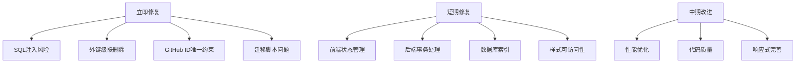

# 项目审查汇总报告

**审查日期**: 2026-03-22  
**项目名称**: Novel Site — 零成本私人小说站

---

## 1. 项目概述

### 项目类型
这是一个基于 Cloudflare 生态系统的全栈小说阅读网站，采用 Serverless 架构，实现零成本部署运行。

### 技术栈

| 层级 | 技术选型 |
|-----|---------|
| 前端 | 纯 HTML/CSS/JavaScript（无框架依赖） |
| 后端 | Cloudflare Functions（Serverless API） |
| 数据库 | Cloudflare D1（SQLite 兼容） |
| 存储 | Cloudflare R2（章节内容存储） |
| 托管 | Cloudflare Pages（静态资源 + CDN） |
| 认证 | HttpOnly Cookie + GitHub OAuth |

### 核心功能
- 📖 阅读体验：多主题、翻页/滚动模式、沉浸模式、阅读统计
- 📚 书籍管理：TXT/EPUB 导入、章节编辑、标签分类
- 💬 批注系统：选中批注、点赞互动、举报治理
- 🔐 权限系统：多角色管理、GitHub OAuth 登录
- 📱 PWA 支持：离线阅读、安装到桌面

---

## 2. 问题统计总览

### 各模块问题数量统计

| 模块 | 🔴 严重 | 🟡 中等 | 🟢 轻微 | 合计 |
|-----|--------|--------|--------|------|
| 前端交互 | 3 | 12 | 8 | 23 |
| 后端 API | 3 | 12 | 8 | 23 |
| 数据库设计 | 4 | 8 | 8 | 20 |
| 样式设计 | 4 | 8 | 12 | 24 |
| **总计** | **14** | **40** | **36** | **90** |

### 严重程度分布

```
🔴 严重 ██████████████ 14 (15.6%)
🟡 中等 ████████████████████████████████████████ 40 (44.4%)
🟢 轻微 █████████████████████████████████████ 36 (40.0%)
```

---

## 3. 严重问题汇总

以下是需要立即关注的所有严重问题，按模块分类：

### 🔴 后端安全（3个）

| # | 问题 | 文件位置 | 风险描述 |
|---|------|---------|---------|
| 1 | SQL注入风险 - 动态ORDER BY | [`functions/api/annotations.js:129`](../functions/api/annotations.js:129) | orderBy变量直接拼接SQL |
| 2 | SQL注入风险 - 动态SET子句 | [`functions/api/admin/users.js:126-134`](../functions/api/admin/users.js:126) | 动态构建UPDATE语句 |
| 3 | SQL注入风险 - 动态WHERE子句 | [`functions/api/admin/annotations.js:42-101`](../functions/api/admin/annotations.js:42) | where数组直接拼接SQL |

### 🔴 数据库设计（4个）

| # | 问题 | 文件位置 | 风险描述 |
|---|------|---------|---------|
| 4 | 外键缺少级联删除 | [`schema.sql:22`](../schema.sql:22) | 删除书籍时关联章节导致失败 |
| 5 | GitHub ID缺少唯一约束 | [`migrations/002_github_oauth.sql:5`](../migrations/002_github_oauth.sql:5) | 多账号绑定同一GitHub |
| 6 | 迁移脚本不可逆 | 所有迁移文件 | 无法回滚到之前状态 |
| 7 | 迁移与Schema重复定义 | [`migrations/001_stats_and_roles.sql:7-35`](../migrations/001_stats_and_roles.sql:7) | 执行顺序冲突 |

### 🔴 前端交互（3个）

| # | 问题 | 文件位置 | 风险描述 |
|---|------|---------|---------|
| 8 | 密码修改后未清除认证状态 | [`admin.html:630-631`](../admin.html:630) | 旧认证状态残留 |
| 9 | 批注系统选区状态丢失 | [`read.html:1490-1507`](../read.html:1490) | 批注创建失败 |
| 10 | EPUB导入DRM检测不完整 | [`admin.html:1603-1610`](../admin.html:1603) | 加密文件解析错误 |

### 🔴 样式设计（4个）

| # | 问题 | 文件位置 | 风险描述 |
|---|------|---------|---------|
| 11 | 移动端断点单一 | [`style.css:576-598`](../style.css:576) | 平板设备适配缺失 |
| 12 | 触摸设备优化不足 | [`style.css`](../style.css) 全局 | 触摸目标小于44px |
| 13 | 翻页模式布局计算问题 | [`style.css:601-714`](../style.css:601) | 移动端内容截断 |
| 14 | z-index层级混乱 | [`style.css:887-1126`](../style.css:887) | 弹窗遮挡冲突 |

---

## 4. 修复优先级建议

### 🚨 立即修复（安全漏洞、数据丢失风险）

这些问题可能导致安全漏洞或数据丢失，应立即处理：

1. **SQL注入风险** - 后端3处动态SQL拼接
   - 使用白名单验证排序字段
   - 确保所有动态字段名来自预定义白名单

2. **外键级联删除** - 数据库设计缺陷
   - 为 `chapters.book_id` 添加 `ON DELETE CASCADE`

3. **GitHub ID唯一约束** - 安全漏洞
   - 添加唯一索引防止多账号绑定

4. **迁移脚本问题** - 运维风险
   - 解决迁移与Schema重复定义
   - 创建迁移回滚脚本

### ⏰ 短期修复（功能Bug、用户体验）

这些问题影响功能正确性和用户体验，应在近期修复：

**前端**
- 密码修改后清除认证状态
- 批注选区状态保存
- DRM检测扩展
- 表单实时验证
- 登录失败清除密码字段

**后端**
- 批注点赞竞态条件（使用事务）
- 搜索LIKE通配符转义
- 章节删除事务包装
- 批注创建IP维度限流

**数据库**
- 添加缺失索引（github_id, user_id）
- 角色字段CHECK约束
- 密码与OAuth混用问题

**样式**
- 触摸目标尺寸优化
- 颜色对比度修正
- 焦点状态样式
- z-index层级整理

### 📅 中期改进（代码质量、性能优化）

这些问题影响代码质量和性能，可计划在中期改进：

**前端**
- 导出功能大文件处理
- 翻页页码计算优化
- 阅读统计定时器清理
- 批注字段验证完善

**后端**
- 速率限制Map清理策略
- 错误消息信息泄露
- OAuth过期时间常量化
- 响应格式统一

**数据库**
- 书籍/章节状态字段
- 管理员账号状态控制
- 数据清理策略实现

**样式**
- 平板断点添加
- 内联样式迁移
- prefers-reduced-motion支持
- 安全区域适配完善

### 🔮 长期优化（技术债务、最佳实践）

这些是技术债务和最佳实践改进，可长期规划：

**代码质量**
- 重复代码提取（authCheck等）
- 魔法数字常量化
- 错误处理统一
- API文档完善
- 注释语言统一

**数据库**
- 邮箱字段添加
- URL Slug字段
- 统计数据归档策略

**样式**
- CSS变量命名统一
- 打印样式添加
- 骨架屏实现
- 高对比度模式支持

---

## 5. 模块问题摘要

### 前端问题摘要

**主要问题领域**：
1. **安全性** - 密码修改后状态清理不完整、XSS风险、DRM检测不完整
2. **用户体验** - 表单验证不及时、进度反馈不明确、操作确认不一致
3. **健壮性** - 选区状态丢失、大文件处理、定时器清理
4. **代码质量** - 事件绑定延迟、错误处理不完整

**问题分布**：严重 3 / 中等 12 / 轻微 8

### 后端问题摘要

**主要问题领域**：
1. **SQL拼接** - 多处使用字符串拼接构建SQL，存在安全隐患
2. **事务使用** - 部分操作缺少事务保护，可能导致数据不一致
3. **一致性** - 响应格式、错误处理、代码风格存在不一致

**问题分布**：严重 3 / 中等 12 / 轻微 8

### 数据库问题摘要

**主要问题领域**：
1. **外键约束** - 级联删除行为缺失
2. **迁移设计** - 不可逆、与Schema重复
3. **索引覆盖** - 部分查询场景缺少索引
4. **状态管理** - 缺少数据状态字段

**问题分布**：严重 4 / 中等 8 / 轻微 8

### 样式问题摘要

**主要问题领域**：
1. **响应式设计** - 只有单一断点，缺少平板适配
2. **可访问性** - 颜色对比度、焦点状态、触摸目标尺寸
3. **代码维护性** - 内联样式过多，z-index层级混乱

**问题分布**：严重 4 / 中等 8 / 轻微 12

---

## 6. 项目亮点

尽管存在上述问题，该项目在多个方面表现出色：

### 🏆 安全设计亮点

| 方面 | 实现方式 |
|-----|---------|
| 密码存储 | PBKDF2 + 随机盐，100K次迭代 |
| Token处理 | 明文存客户端，DB只存哈希值 |
| CSRF防护 | Admin API写操作要求 `application/json` |
| IP限流 | 登录失败5次锁定10分钟 |
| 文件上传 | 验证文件头魔数，不仅依赖Content-Type |
| OAuth安全 | State参数使用HMAC签名，一次性消费 |
| XSS防护 | 设置完整的CSP头 |
| 隐私保护 | IP地址存储前进行哈希处理 |

### ✨ 架构设计亮点

- **零成本部署** - 完全运行在 Cloudflare 免费套餐上
- **Serverless架构** - 无需管理服务器，自动扩展
- **前后端分离** - 纯静态前端 + API 后端
- **离线支持** - PWA 实现离线阅读

### 💡 功能实现亮点

- **多主题支持** - 5种阅读主题，CSS变量实现
- **双阅读模式** - 滚动模式 + 翻页模式
- **批注系统** - 完整的批注、点赞、举报机制
- **权限分级** - 超管/管理员/演示用户三级权限
- **数据导入** - TXT智能识别 + EPUB解析导入

### 📝 代码质量亮点

- **纯原生实现** - 无框架依赖，代码简洁易懂
- **语义化命名** - CSS类名、变量命名清晰
- **模块化组织** - API按功能分文件组织

---

## 7. 总结与建议

### 总体评价

该项目作为一个零成本私人小说站，在功能完整性和安全设计方面表现出色。审查发现的90个问题中，严重问题14个（15.6%），主要集中在SQL注入风险、数据库设计缺陷和响应式适配不足。

### 核心建议

1. **安全优先** - 立即修复3处SQL注入风险点，使用白名单验证或参数化查询
2. **数据完整性** - 添加外键级联删除和唯一约束，确保数据一致性
3. **迁移规范** - 完善迁移脚本，支持回滚，避免与Schema冲突
4. **用户体验** - 优化触摸目标尺寸和颜色对比度，提升可访问性
5. **代码规范** - 统一响应格式、错误处理和代码注释语言

### 下一步行动



---

*报告生成时间: 2026-03-22*