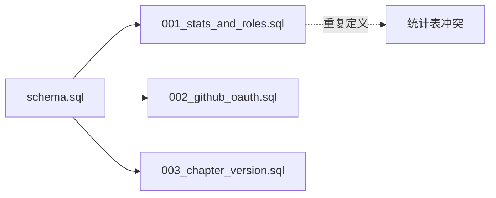

# 数据库设计审查报告

## 审查范围
- `schema.sql` - 主数据库架构
- `migrations/001_stats_and_roles.sql` - 统计和角色迁移
- `migrations/002_github_oauth.sql` - GitHub OAuth迁移
- `migrations/003_chapter_version.sql` - 章节版本迁移

---

## 问题列表

### 🔴 严重问题

#### 1. 外键缺少级联删除行为
- **文件**: [`schema.sql`](schema.sql:22)
- **位置**: 第 22 行
- **问题描述**: `chapters` 表的外键约束 `FOREIGN KEY (book_id) REFERENCES books(id)` 没有指定 `ON DELETE` 行为，默认为 `NO ACTION`。当删除书籍时，如果有关联章节存在，会导致删除失败或数据不一致。
- **修复建议**: 
  ```sql
  FOREIGN KEY (book_id) REFERENCES books(id) ON DELETE CASCADE
  ```

#### 2. GitHub ID 缺少唯一约束
- **文件**: [`migrations/002_github_oauth.sql`](migrations/002_github_oauth.sql:5)
- **位置**: 第 5 行
- **问题描述**: `github_id` 字段没有唯一约束，可能导致多个管理员账号绑定同一个 GitHub 账号，造成安全漏洞和数据混乱。
- **修复建议**: 
  ```sql
  -- 需要创建唯一索引
  CREATE UNIQUE INDEX IF NOT EXISTS idx_admin_users_github_id ON admin_users(github_id) WHERE github_id IS NOT NULL;
  ```

#### 3. 迁移脚本不可逆
- **文件**: 所有迁移文件
- **位置**: 
  - [`migrations/001_stats_and_roles.sql`](migrations/001_stats_and_roles.sql:1)
  - [`migrations/002_github_oauth.sql`](migrations/002_github_oauth.sql:1)
  - [`migrations/003_chapter_version.sql`](migrations/003_chapter_version.sql:1)
- **问题描述**: 所有迁移脚本都只有 UP 操作，没有对应的 DOWN 回滚操作。如果迁移出现问题，无法回滚到之前的状态。
- **修复建议**: 为每个迁移创建对应的回滚脚本，或使用支持版本回滚的迁移工具。

#### 4. 迁移与主 Schema 重复定义
- **文件**: [`migrations/001_stats_and_roles.sql`](migrations/001_stats_and_roles.sql:7-35)
- **位置**: 第 7-35 行
- **问题描述**: 迁移文件中定义的表（`site_visits`, `daily_visitors`, `book_stats`, `chapter_stats`）与 `schema.sql` 中的定义完全重复。如果先执行了 `schema.sql`，再执行迁移会报错或产生冲突。
- **修复建议**: 
  - 方案一：`schema.sql` 只包含基础表，统计表由迁移创建
  - 方案二：迁移使用 `CREATE TABLE IF NOT EXISTS` 并确保幂等性
  - 方案三：明确文档说明执行顺序和依赖关系

---

### 🟡 中等问题

#### 5. 缺少管理员会话索引
- **文件**: [`schema.sql`](schema.sql:40-46)
- **位置**: 第 40-46 行
- **问题描述**: `admin_sessions` 表的 `user_id` 字段缺少索引，当查询某用户的所有会话时会导致全表扫描。
- **修复建议**: 
  ```sql
  CREATE INDEX IF NOT EXISTS idx_admin_sessions_user_id ON admin_sessions(user_id);
  ```

#### 6. 缺少 GitHub ID 索引
- **文件**: [`migrations/002_github_oauth.sql`](migrations/002_github_oauth.sql:5)
- **位置**: 第 5 行
- **问题描述**: `github_id` 字段用于 OAuth 登录时的用户查找，但没有索引会导致登录时全表扫描。
- **修复建议**: 
  ```sql
  CREATE INDEX IF NOT EXISTS idx_admin_users_github_id ON admin_users(github_id);
  ```

#### 7. 角色字段缺少约束
- **文件**: [`schema.sql`](schema.sql:34) 和 [`migrations/001_stats_and_roles.sql`](migrations/001_stats_and_roles.sql:49)
- **位置**: `schema.sql` 第 34 行，迁移第 49 行
- **问题描述**: `role` 字段没有 CHECK 约束，可以插入任意值，可能导致权限控制失效。
- **修复建议**: 
  ```sql
  role TEXT DEFAULT 'editor' CHECK(role IN ('super_admin', 'admin', 'editor'))
  ```

#### 8. 缺少书籍状态字段
- **文件**: [`schema.sql`](schema.sql:2-10)
- **位置**: 第 2-10 行
- **问题描述**: `books` 表缺少 `status` 字段，无法区分书籍状态（如：草稿、已发布、已下架）。
- **修复建议**: 
  ```sql
  ALTER TABLE books ADD COLUMN status TEXT DEFAULT 'draft' CHECK(status IN ('draft', 'published', 'archived'));
  ```

#### 9. 缺少章节状态字段
- **文件**: [`schema.sql`](schema.sql:13-23)
- **位置**: 第 13-23 行
- **问题描述**: `chapters` 表缺少 `status` 字段，无法区分章节状态（如：草稿、已发布）。
- **修复建议**: 
  ```sql
  ALTER TABLE chapters ADD COLUMN status TEXT DEFAULT 'draft' CHECK(status IN ('draft', 'published'));
  ```

#### 10. 章节排序字段缺少唯一约束
- **文件**: [`schema.sql`](schema.sql:17)
- **位置**: 第 17 行
- **问题描述**: `sort_order` 字段在同一本书内应该唯一，但当前没有约束，可能导致排序冲突。
- **修复建议**: 
  ```sql
  CREATE UNIQUE INDEX IF NOT EXISTS idx_chapters_book_order ON chapters(book_id, sort_order);
  ```

#### 11. 缺少管理员账号状态控制
- **文件**: [`schema.sql`](schema.sql:30-37)
- **位置**: 第 30-37 行
- **问题描述**: `admin_users` 表缺少 `is_active` 或 `status` 字段，无法禁用账号。
- **修复建议**: 
  ```sql
  ALTER TABLE admin_users ADD COLUMN is_active INTEGER DEFAULT 1;
  ```

#### 12. 密码哈希与 OAuth 混用问题
- **文件**: [`schema.sql`](schema.sql:33) 和 [`migrations/002_github_oauth.sql`](migrations/002_github_oauth.sql:1-11)
- **位置**: `schema.sql` 第 33 行
- **问题描述**: `password_hash` 字段标记为 `NOT NULL`，但使用 GitHub OAuth 登录的用户不需要密码。当前迁移添加的 `github_id` 等字段无法解决此问题。
- **修复建议**: 
  - 将 `password_hash` 改为可空
  - 或添加 CHECK 约束确保至少有一种认证方式
  ```sql
  password_hash TEXT DEFAULT NULL,
  CHECK(password_hash IS NOT NULL OR github_id IS NOT NULL)
  ```

---

### 🟢 轻微问题

#### 13. 缺少邮箱字段
- **文件**: [`schema.sql`](schema.sql:30-37)
- **位置**: 第 30-37 行
- **问题描述**: `admin_users` 表缺少 `email` 字段，无法发送通知或进行邮箱验证。
- **修复建议**: 
  ```sql
  ALTER TABLE admin_users ADD COLUMN email TEXT DEFAULT NULL;
  CREATE UNIQUE INDEX IF NOT EXISTS idx_admin_users_email ON admin_users(email) WHERE email IS NOT NULL;
  ```

#### 14. 缺少书籍 URL Slug 字段
- **文件**: [`schema.sql`](schema.sql:2-10)
- **位置**: 第 2-10 行
- **问题描述**: `books` 表缺少 `slug` 字段，无法实现 SEO 友好的 URL。
- **修复建议**: 
  ```sql
  ALTER TABLE books ADD COLUMN slug TEXT UNIQUE DEFAULT NULL;
  ```

#### 15. 描述字段无长度限制
- **文件**: [`schema.sql`](schema.sql:5)
- **位置**: 第 5 行
- **问题描述**: `description` 字段使用 TEXT 类型无长度限制，可能导致存储过大内容。虽然 SQLite 不强制执行 TEXT 长度，但建议在应用层验证。
- **修复建议**: 在应用层限制描述长度（如 2000 字符）。

#### 16. 缺少数据清理策略文档
- **文件**: [`schema.sql`](schema.sql:76-80) 和 [`migrations/001_stats_and_roles.sql`](migrations/001_stats_and_roles.sql:14-18)
- **位置**: `daily_visitors` 表定义
- **问题描述**: `daily_visitors` 表会随时间快速增长，注释提到"次日可清理"但没有实现清理机制。
- **修复建议**: 
  - 添加定时任务清理过期数据
  - 或在迁移中添加说明文档

#### 17. 统计数据缺少归档策略
- **文件**: [`schema.sql`](schema.sql:83-96)
- **位置**: 第 83-96 行
- **问题描述**: `book_stats` 和 `site_visits` 按日期存储，长期运行后数据量会很大，缺少归档策略。
- **修复建议**: 
  - 添加月度/季度归档表
  - 或实现数据聚合策略

#### 18. 版本号字段缺少使用说明
- **文件**: [`migrations/003_chapter_version.sql`](migrations/003_chapter_version.sql:5)
- **位置**: 第 5 行
- **问题描述**: `version` 字段用于乐观锁，但迁移文件中没有说明使用方式，可能导致开发者不理解其用途。
- **修复建议**: 在迁移文件中添加详细注释说明乐观锁的使用方式。

#### 19. 会话 Token 无长度约束
- **文件**: [`schema.sql`](schema.sql:41)
- **位置**: 第 41 行
- **问题描述**: `admin_sessions.token` 使用 TEXT 类型，没有长度约束。建议使用固定长度的哈希值。
- **修复建议**: 在应用层确保 token 使用固定长度的安全随机值（如 64 字符的 hex）。

#### 20. 缺少创建/更新时间自动维护
- **文件**: [`schema.sql`](schema.sql:8-9)
- **位置**: 第 8-9 行
- **问题描述**: `created_at` 和 `updated_at` 字段只有默认值，`updated_at` 不会自动更新。SQLite 不支持 `ON UPDATE CURRENT_TIMESTAMP`。
- **修复建议**: 在应用层代码中确保每次更新时手动设置 `updated_at`。

---

## 数据完整性分析

### 外键约束检查

| 表 | 外键 | 级联删除 | 状态 |
|---|---|---|---|
| chapters | book_id → books(id) | ❌ 缺失 | 需修复 |
| admin_sessions | user_id → admin_users(id) | ✅ 已设置 | 正常 |
| book_stats | book_id → books(id) | ✅ 已设置 | 正常 |
| chapter_stats | chapter_id → chapters(id) | ✅ 已设置 | 正常 |

### 索引覆盖分析

| 表 | 查询场景 | 索引状态 |
|---|---|---|
| books | 主键查询 | ✅ 自动索引 |
| chapters | 按书籍查询 | ✅ 已有索引 |
| chapters | 按书籍+排序 | ✅ 已有索引 |
| admin_users | 按用户名查询 | ✅ UNIQUE 自动索引 |
| admin_users | 按 GitHub ID 查询 | ❌ 缺失 |
| admin_sessions | 按用户查询 | ❌ 缺失 |
| admin_sessions | 按 token 查询 | ✅ 主键 |
| book_stats | 按书籍+日期 | ✅ 已有索引 |
| daily_visitors | 按日期 | ✅ 已有索引 |

---

## 安全问题分析

### 1. 敏感数据存储
- ✅ 密码使用 `password_hash` 存储，不是明文
- ⚠️ 缺少密码哈希算法说明（应使用 bcrypt/argon2）
- ⚠️ `ip_hash` 存储的是 IP 哈希，但未说明哈希方法

### 2. 权限设计
- ⚠️ `role` 字段缺少 CHECK 约束
- ⚠️ 缺少细粒度权限表（如 role_permissions）

### 3. 会话安全
- ⚠️ 缺少会话过期清理机制
- ⚠️ 缺少单用户最大会话数限制

---

## 迁移脚本分析

### 迁移依赖关系



### 迁移风险评估

| 迁移文件 | 风险等级 | 风险描述 |
|---|---|---|
| 001 | 🟡 中 | 表重复定义，ALTER TABLE 可能失败 |
| 002 | 🟢 低 | 仅添加列，风险较小 |
| 003 | 🟢 低 | 仅添加列，风险较小 |

---

## 建议修复优先级

### 立即修复（严重）
1. 为 `chapters.book_id` 添加 `ON DELETE CASCADE`
2. 为 `github_id` 添加唯一约束
3. 解决迁移与 schema 重复定义问题
4. 创建迁移回滚脚本

### 尽快修复（中等）
1. 添加缺失的索引
2. 添加角色字段 CHECK 约束
3. 添加书籍/章节状态字段
4. 解决密码与 OAuth 混用问题

### 计划修复（轻微）
1. 添加邮箱字段
2. 添加 URL Slug 字段
3. 实现数据清理和归档策略
4. 完善文档和注释

---

## 总结

本次审查共发现 **20 个问题**：
- 🔴 严重问题：4 个
- 🟡 中等问题：8 个
- 🟢 轻微问题：8 个

主要问题集中在：
1. 外键约束不完整
2. 迁移脚本设计缺陷
3. 索引覆盖不足
4. 缺少数据状态管理

建议在正式上线前优先修复严重和中等问题。